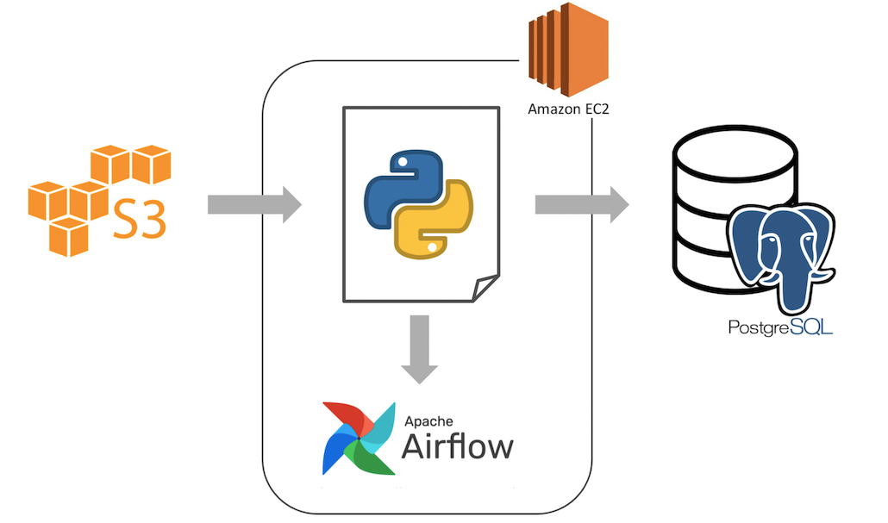

# peterparker

<p>Welcome.</p>
The name **peterparker** for this project is inspired by the random user airflow created during a [quickstart instalation tutorial](https://airflow.apache.org/docs/apache-airflow/stable/start/local.html).
This project attempts to build a simple data warehouse out of [this dataset](https://www.kaggle.com/edgartanaka1/tmdb-movies-and-series).


## Prepipeline
1. The pipeline assumes that the **source dataset is stored in AWS S3** somehow.
   - In this simulation, [the dataset](https://www.kaggle.com/edgartanaka1/tmdb-movies-and-series) is downloaded manually to a local machine.
   - Then uploaded to s3 using [upload_to_s3.py](https://github.com/dindapw/peterparker/blob/main/peterparker/upload_to_s3.py) script.
2. The pipeline is deployed in AWS EC2, and scheduled in Airflow (which also deployed in EC2).
   - Credential for S3 and PostgreSQL is saved in configuration file inside the EC2 server.
   - Environment variables is an option to set credentials but it's quite annoying to use back and forth between local machine venv and server.
   - Tutorial on how to setup free EC2 to host airflow can be read [here](https://medium.com/@dindapw/install-airlfow-2-0-on-awss-free-tier-ec2-8ab4b70d8d)
3. The choosen database for the data warehouse is PostgreSQL.
4. The pipeline uses two separate script [replicate_movies.py](peterparker/replicate_movies.py) and [replicate_series.py](peterparker/replicate_series.py), because of a few things:
   - The json struncture for movies and series is a bit different.
   - Making things generic is not always a good thing, sometimes it can be too complicated of a solution for simple problem.
   - The classic, not enough time to do it "better".


## Tech Stack


## Pipeline
1. Open folder (movies/ or series/)
2. Read a file from folder.
3. Convert file content to json.
4. Transform and split json into different entity based on the table structure that has been created.
5. Upsert data to table.
6. If the process 3 thru 5 is succesful, then file will be moved to folder archive/.
7. If the process 3 thru 5 throws an error, then file will be moved to folder error/.
8. Repeat process 1 thru 6 until there is no more file to read.


## Data Ware House


Here is the list of table. Each table has date_effective to indicate when the data is replicated to the table. If there's a duplicate data, it will be updated, including the date_effective.

<details>
<summary> table "series" </summary>
<p>This table holds the details of tv series and including the popularity and rating.</p>
<p>

```sql
create table series
(
    id                   int,
    backdrop_path        text,
    created_by           int[],
    episode_run_time     int[],
    genres               int[],
    homepage             text,
    in_production        boolean,
    languages            text[],
    first_air_date       date,
    last_air_date        date,
    last_episode_to_air  json,
    name                 text,
    next_episode_to_air  json,
    networks             int[],
    number_of_episodes   int,
    number_of_seasons    int,
    origin_country       text[],
    original_language    text,
    original_name        text,
    overview             text,
    popularity           numeric(6, 3),
    poster_path          text,
    production_companies int[],
    seasons              json,
    status               text,
    type                 text,
    vote_average         numeric(4, 2),
    vote_count           int,
    date_effective       timestamp
);
```
</p>
</details>


<details>
<summary> table "movie" </summary>
<p>This table holds the details of movie and including the popularity and rating given to the movie.</p>
<p>

```sql
create table movie
(
    id                    int,
    adult                 boolean,
    backdrop_path         text,
    belongs_to_collection json,
    budget                int,
    genres                int[],
    homepage              text,
    imdb_id               text,
    original_language     text,
    original_title        text,
    overview              text,
    popularity            numeric(6, 3),
    poster_path           text,
    production_companies  int[],
    production_countries  text[],
    release_date          timestamp,
    revenue               int,
    runtime               int,
    spoken_languages      text[],
    status                text,
    tagline               text,
    title                 text,
    video                 boolean,
    vote_average          numeric(4, 2),
    vote_count            int,
    date_effective        timestamp
);
```
</p>
</details>


<details>
<summary> table "creator" </summary>
<p>This table contains the creator of series. You can join this table with series to find out which creator has the highest rating series, etc..</p>
<p>

```sql
create table creator
(
    id             int,
    credit_id      text,
    name           text,
    gender         int,
    profile_path   text,
    date_effective timestamp
);
```
</p>
</details>

<details>
<summary> table "genre" </summary>
<p>This table contains a list of genre of all the movie and series data we collected.</p>
<p>

```sql
create table genre
(
    id             int,
    name           text,
    date_effective timestamp
);

```
</p>
</details>

<details>
<summary> table "language" </summary>
<p>This table contains list of languages (spoken or not) for all series and movie data we collected.</p>
<p>

```sql
create table language
(
    code           text,
    name           text,
    date_effective timestamp
);

```
</p>
</details>

<details>
<summary> table "network" </summary>
<p>This table contains list of network that air the series.</p>
<p>

```sql
create table network
(
    id             int,
    name           text,
    logo_path      text,
    origin_country text,
    date_effective timestamp
);

```
</p>
</details>


<details>
<summary> table "country" </summary>
<p>This table contains list of country where the movie production take place.</p>
<p>

```sql
create table country
(
    code           text,
    name           text,
    date_effective timestamp
);

```
</p>
</details>


<details>
<summary> table "production_company" </summary>
<p>This table contains list of production company that make the movie.</p>
<p>

```sql
create table production_company
(
    id             int,
    logo_path      text,
    name           text,
    origin_country text,
    date_effective timestamp
);

```
</p>
</details>


## Improvement
- The process of reading file and saving it to database is quite slow. We should implement paralelism, by listing all files in the folder, and divide it into 5 or something. Then each of them will go thru the same proses as the current pipline.
- Perhaps we can also create fact table that combine series, movies, and their popularity and vote.
